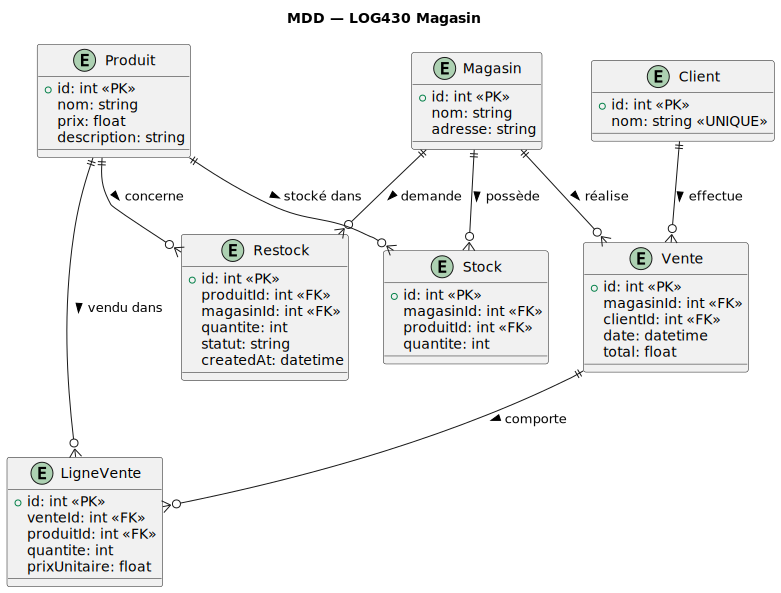

# Rapport d’architecture – LOG430 Lab 2

## Liens vers les dépôts Github

- Lab0 : [https://github.com/Minh-Khoi-Le/log430-lab0.git](https://github.com/Minh-Khoi-Le/log430-lab0.git)
- Lab1 : [https://github.com/Minh-Khoi-Le/log430-lab1-cli.git](https://github.com/Minh-Khoi-Le/log430-lab1-cli.git)
- Lab2 : [https://github.com/Minh-Khoi-Le/log430-lab2.git](https://github.com/Minh-Khoi-Le/log430-lab2.git)

## 1. Introduction et objectifs

- **Finalité du projet** :  
  Système distribué de gestion pour une chaîne de magasins, comprenant la gestion des stocks, ventes, restocks multi-magasin et génération de rapports avancés pour la maison mère (type ElasticSearch/Kibana).
- **Enjeux principaux** :  
  Modularité, évolutivité, maintenabilité, interface moderne, déploiement conteneurisé.

---

## 2. Contraintes

- Stack full JS/TS : React (Vite), Node.js/Express, Prisma, PostgreSQL, Docker Compose.
- Modularité du backend par domaines : maison mère, magasins, clients, etc.
- API REST standardisée.
- Déploiement multi-conteneur (Docker).
- _Tests automatisés exclus pour l’instant._

---

## 3. Vue contextuelle

- **Acteurs** :
  - Gestionnaire (maison mère)
  - Client (acheteur)
- **Systèmes externes** :
  - Aucun (API et Webapp sont internes)

---

## 4. Vue fonctionnelle (cas d’utilisation)

- **Principaux cas d’utilisation** :
  - CRUD produits, magasins, stocks
  - Enregistrement ventes


---

## 5. Vue logique (modèle de domaine)

- **Domaines principaux** :
  - Produit, Magasin, Stock, Vente, Client, Restock, MaisonMere



---

## 6. Vue processus (séquence/exécution)

- **Vente d'un produit** :
  - Achat client (création vente, update stock)
  


---

## 7. Vue développement (implémentation/code)

- **Arborescence** :
  
  ```plaintext
  
  .
  ├─ client/
  │  └─ src/
  │      ├─ components/
  │      ├─ pages/
  │      └─ context/
  ├─ server/
  │  ├─ routes/
  │  ├─ dao/
  │  └─ prisma/
  └─ docker-compose.yml

  ```

- **Structuration :**
  - Découpage DAO/routes par domaine
  - Frontend : pages et composants réutilisables

---

## 8. Vue déploiement

- **Docker Compose**
  - Services : client, server, db
  - Ports : 3800 (API), 5173 (client), 5432 (db)


---

## 9. Décisions architecturales (ADR)

## ADR-001 – Migration ORM/DB

**Contexte** :  
L’ancien système utilisait Hibernate/SQLite. Pour la nouvelle version, un choix devait être fait pour supporter une stack JS moderne et la conteneurisation.

**Décision** :  
Adoption de Prisma ORM (Node.js) et PostgreSQL.

**Conséquences** :

- Cohérence fullstack JS.
- Plus facile à dockeriser.
- Support natif des migrations et du typage fort.
- Plus facile à maintenir en équipe fullstack.

---

## 10. Qualités / solutions techniques

- **Sécurité** : authentification simplifiée
- **Modularité** : séparation stricte des domaines
- **Scalabilité** : possible extension vers microservices ultérieurement
- **Résilience** : logique de rollback transactionnel sur ventes/restock

---

## 11. Risques / points faibles

- Pas d’authentification forte
- Pas de tests automatisés

---
